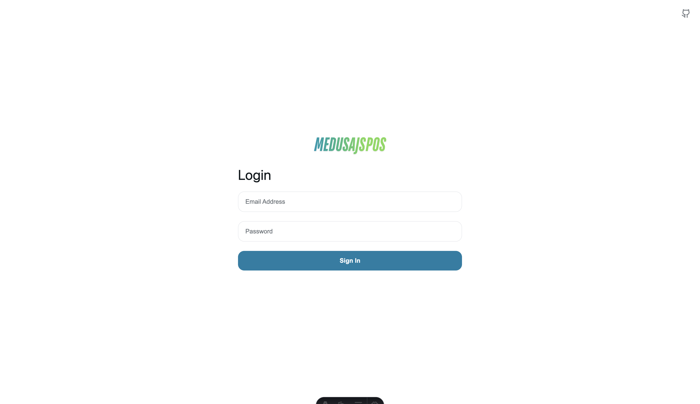
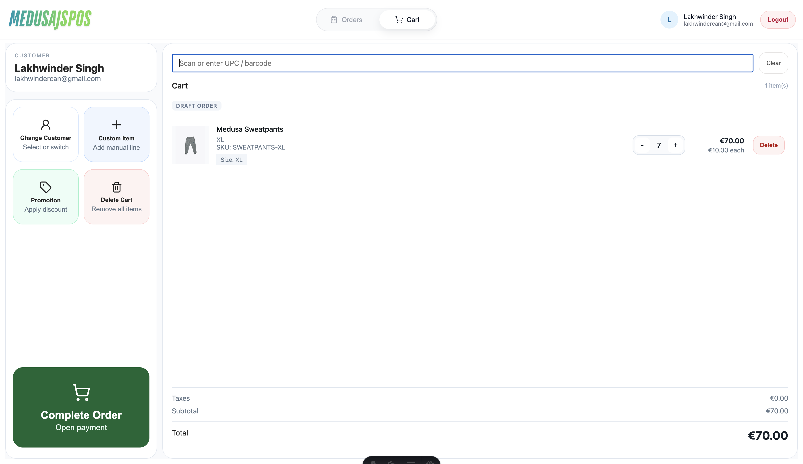
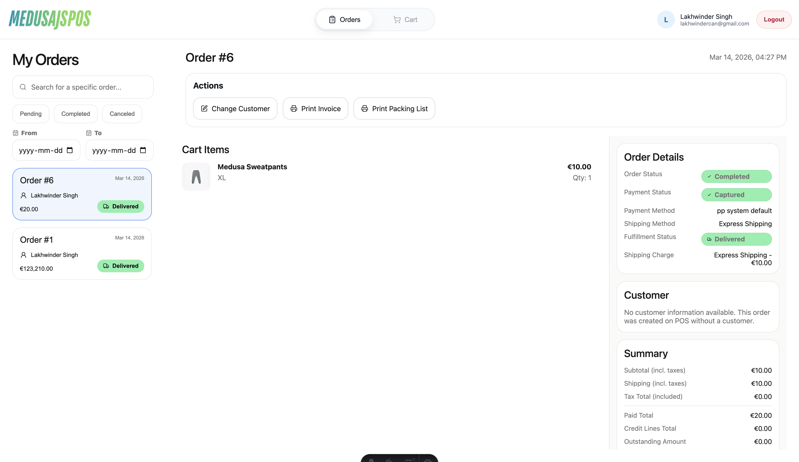

# medusajs-pos (Frontend)

<p align="center">
  
</p>

The staff-facing Point of Sale (POS) frontend interface for Medusa v2. Built with Astro and React, it provides a premium, responsive UI for managing in-store sales, customers, and orders.

---

---

## 📸 Preview

| Login Page | Cart Page | Orders Page |
|:---:|:---:|:---:|
|  |  |  |

---

## 🚀 Overview

`medusajs-pos` is the user interface designed for store staff to use on tablets, desktops, or dedicated POS terminals. It communicates with a Medusa backend (extended by [`medusajs-pos-helper`](../medusajs-pos-helper)) to provide a seamless checkout experience.

---

## ✨ Features

- **Staff Authentication**: Secure login for store associates.
- **Customer Management**:
    - Select existing customers.
    - Search for customers via name or email.
    - Create new customers on-the-fly.
- **Product Catalog Browsing**: Browse and search products with ease.
- **Cart Management**:
    - Add/remove items with real-time total updates.
    - Manage quantities.
- **Order Processing**:
    - Process transactions and view order history.
    - Manage order details and statuses.
- **Onboarding Experience**: Guided flow for initial setup and configuration.
- **Responsive Design**: Optimized for touchscreens and desktop use with a premium aesthetic.

---

## 🛠️ Tech Stack

- **Framework**: [Astro](https://astro.build/) (v6.0+)
- **UI Library**: [React](https://reactjs.org/) (v18.2+)
- **SDK**: [@medusajs/js-sdk](https://docs.medusajs.com/js-sdk/overview)
- **Icons**: [Lucide React](https://lucide.dev/)
- **State Management**: React Hooks & Context
- **Validation**: [Zod](https://zod.dev/)

---

## 🏁 Getting Started

### Prerequisites

- Node.js >= 22.12.0
- A running Medusa v2 backend with the `medusajs-pos-helper` plugin installed.

### Installation

1. Clone the repository.
2. Install dependencies:
   ```bash
   npm install
   ```
3. Configure environment variables (create a `.env` file):
   ```env
   PUBLIC_MEDUSA_BACKEND_URL=your_medusa_backend_url
   ```
4. Start the development server:
   ```bash
   npm run dev
   ```

---

## 🤝 Contributors

Contributions are welcome! Please refer to the [root CONTRIBUTING.md](../CONTRIBUTING.md) for details.

- [Lakhwinder Singh (Lucky)](https://github.com/luckycrm)

---

## 💖 Funding

Support the development of this POS system via:

[](https://buymeacoffee.com/luckycrm)
[](https://paypal.me/@thatlucifer)

---

## 📄 License

MIT
